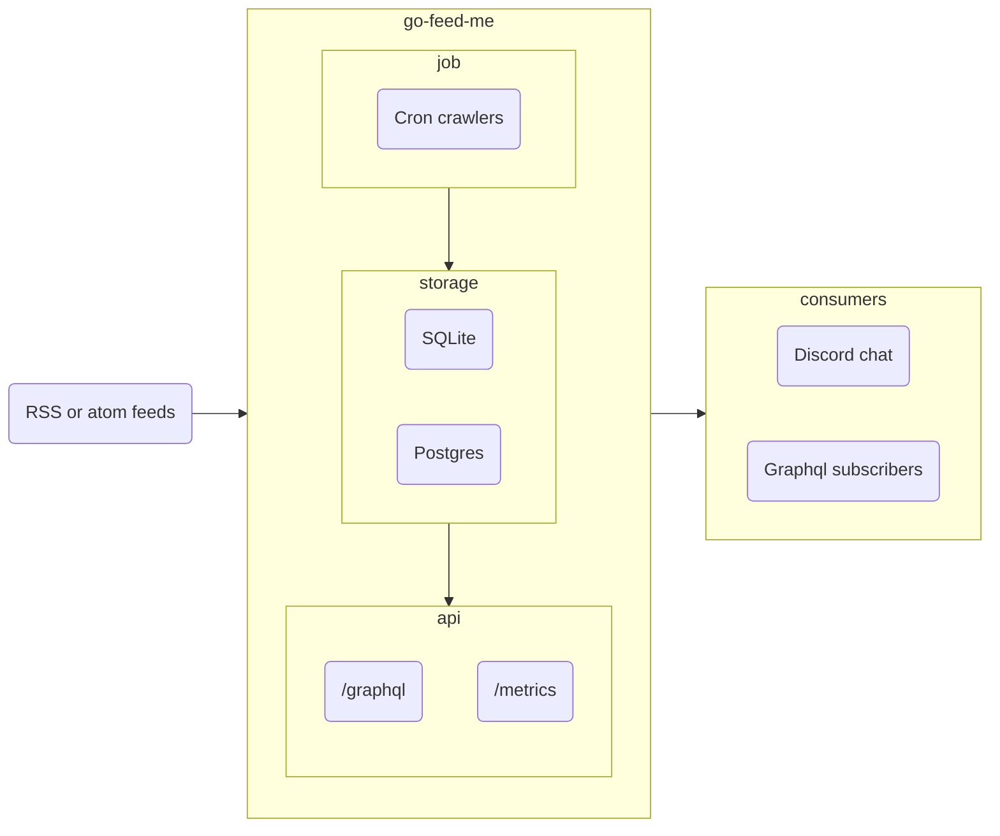

# Feeds notifier as a service

This is a simple RSS and Atom feed notifier. It fetches new articles from feed resources and notifies consumers like `discord` chat or `graphql` API subscribers.

[](https://hub.docker.com/r/sealbro/go-feed-me/)



## Features

- [x] GraphQL UI and API
- [x] Storing data in database (sqlite, postgres)
- [x] Adding new RSS feed resources and store them
- [x] Fetch new articles from RSS feed resources
- [x] Notify new articles to graphql subscribers, discord.
- [x] Observability (logs, metrics, traces)
- [ ] Support more subscribers (slack, email, etc) or make it pluggable
- [ ] Support multiple users and roles
- [ ] Support filtering resources (maybe articles) by tags

## Quick start

```bash
docker run -it --rm -p 8080:8080 -p 8081:8081 sealbro/go-feed-me:latest
```

Open [http://localhost:8080/feed/graphql/](http://localhost:8080/feed/graphql/) in your browser.

### Environment variables

| Name                          | Description                | Default          |
|-------------------------------|----------------------------|------------------|
| `SLUG`                        | Path api prefix            | `feed`           |
| `PUBLIC_ADDRESS`              | Public api address         | `:8080`          |
| `PRIVATE_ADDRESS`             | Private metrics address    | `:8081`          |
| `CRON`                        | Cron pattern when run jobs | `1/60 * * * * *` |
| `SQLITE_CONNECTION`           | Sqlite file location       | `/feed.db`       |
| `POSTGRES_CONNECTION`         | Postgres connection string | empty            |
| `DISCORD_WEBHOOK_ID`          | Discord webhook id         | empty            |
| `DISCORD_WEBHOOK_TOKEN`       | Discord webhook token      | empty            |
| `LOG_LEVEL`                   | slog level                 | `INFO`           |
| `OTEL_EXPORTER_OTLP_ENDPOINT` | Otlp grpc endpoint         | empty            |

- Postgres [connection string](https://gorm.io/docs/connecting_to_the_database.html#PostgreSQL): `host=<ip or host> user=<username> password=<password> dbname=feed port=5432 sslmode=disable`
- Discord how get id and token for [webhook](https://support.discord.com/hc/en-us/articles/228383668-Intro-to-Webhooks)
- Cron pattern [quartz](https://github.com/reugn/go-quartz)

## Graphql

### Queries

```graphql
query Articles {
    articles (after: "2023-01-01T15:04:05.999999999Z") {
        published,
        link,
        title,
        description,
        content
    }
}
```

```graphql
query Resources {
    resources(active: true) {
        url
        title
        active
        created
        modified
        published
    }
}
```

### Mutations

```graphql
mutation AddResources {
    addResources (resources: [
        {url: "https://github.com/opencv/opencv/releases.atom", active: true},
        {url: "https://github.com/openvinotoolkit/openvino/releases.atom", active: true},
        {url: "https://github.com/hybridgroup/gocv/releases.atom", active: true},
    ]) 
}
```

```graphql
mutation ActivateResources {
    activateResources ( 
        urls: ["https://github.com/opencv/opencv/releases.atom"],
        active: false
    ) 
}
```

```graphql
mutation RemoveResources {
    removeResources ( 
        urls: ["https://github.com/opencv/opencv/releases.atom"]
    ) 
}
```

### Subscriptions

```graphql
subscription notifyNewData {
    articles {
        title
        description
        content
        link
    }
}
```

## Contributing

### Build

Build docker image locally:
```bash
docker build --build-arg GO_VERSION="$(grep '^go' go.mod | awk '{print $2}')" -t feed .
````
### Run

Run local built docker image:
```bash
docker run -it --rm -p 8080:8080 -p 8081:8081 feed
```

### Re-generate graphql schema

```bash
make generate
```